# 🚀 Express 백엔드 과제 (Backend Assignment)

> 백엔드 프레임워크 실습 과제 제출물입니다. Express.js 기반으로 8개의 REST API와 공통 미들웨어, 다양한 상태 코드를 구현했습니다.

---

## 📌 개요

- **프레임워크:** Express.js  
- **언어:** Node.js (ES Module)  
- **과제 목표:**  
  - HTTP 메서드별 API(POST, GET, PUT, DELETE) 각 2개씩, 총 8개 구현  
  - 공통 미들웨어 추가 (요청 로그, 입력 검증, 에러 처리 등)  
  - 2xx / 4xx / 5xx 응답 코드를 다양하게 활용  
  - `{ "status": "success|error", ... }` 구조의 표준 JSON 응답 유지

---

## 🧩 구현 내용 요약

| 항목 | 세부 내용 |
|------|-----------|
| **HTTP 메서드** | POST / GET / PUT / DELETE 각각 2개씩 총 8개 |
| **미들웨어** | 요청 로거(`morgan`), 입력 검증(`requireFields`), 전역 에러 핸들러 |
| **응답 형식** | `{ "status": "success", "data": { ... } }`<br>`{ "status": "error", "error": { ... } }` |
| **상태 코드 다양성** | 200, 201, 400, 404, 409, 500, 503 |

---

## ⚙️ 실행 방법

```bash
npm install
npm run start
# 서버 실행 후 http://localhost:3000 접속
```

---

## 🧠 미들웨어 (Middleware)

### 🟢 `logger.js`
모든 요청에 대해 시간, 메서드, URL, 상태 코드, 응답 시간을 콘솔에 출력합니다.

```js
import morgan from "morgan";

export const logger = morgan((tokens, req, res) => {
  const time = new Date().toISOString();
  return `[${time}] ${tokens.method(req, res)} ${tokens.url(req, res)} ${tokens.status(req, res)} ${tokens["response-time"](req, res)} ms`;
});
```

### 🟡 `validate.js`
요청 본문에서 필수 필드가 누락되었을 경우 400 응답을 반환합니다.

```js
export const requireFields = (fields = []) => (req, res, next) => {
  const missing = fields.filter((f) => req.body?.[f] === undefined);
  if (missing.length) {
    return fail(res, 400, "VALIDATION_ERROR", "필수 필드가 누락되었습니다.", { missing });
  }
  next();
};
```

### 🔴 전역 에러 핸들러
`try/catch`로 잡히지 않은 예외를 처리하고, 500 응답(JSON)을 반환합니다.

```js
app.use((err, req, res, next) => {
  console.error(err);
  fail(res, err.status ?? 500, err.code ?? "INTERNAL_ERROR", err.message ?? "예상치 못한 오류가 발생했습니다.");
});
```

---

## 📡 구현한 API 목록

| 메서드 | 엔드포인트 | 설명 | 성공 코드 | 오류 코드 |
|--------|------------|------|-----------|-----------|
| POST | `/items` | 새 아이템 생성 | 201 | 400, 409 |
| POST | `/items/:id/duplicate` | 기존 아이템 복제 | 201 | 404 |
| GET | `/items` | 모든 아이템 조회 | 200 | 503 |
| GET | `/items/:id` | 단일 아이템 조회 | 200 | 404 |
| PUT | `/items/:id` | 아이템 수정 | 200 | 409 |
| PUT | `/items/:id/publish` | 아이템 발행 | 200 | 400 |
| DELETE | `/items/:id` | 소프트 삭제 | 200 | 404 |
| DELETE | `/items/:id/force` | 완전 삭제 | 200 | 404 |

---

## 🖼️ 실행 및 테스트 캡처

- **POST 메서드 테스트**  
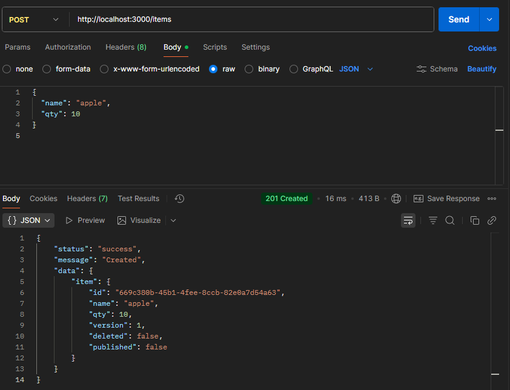
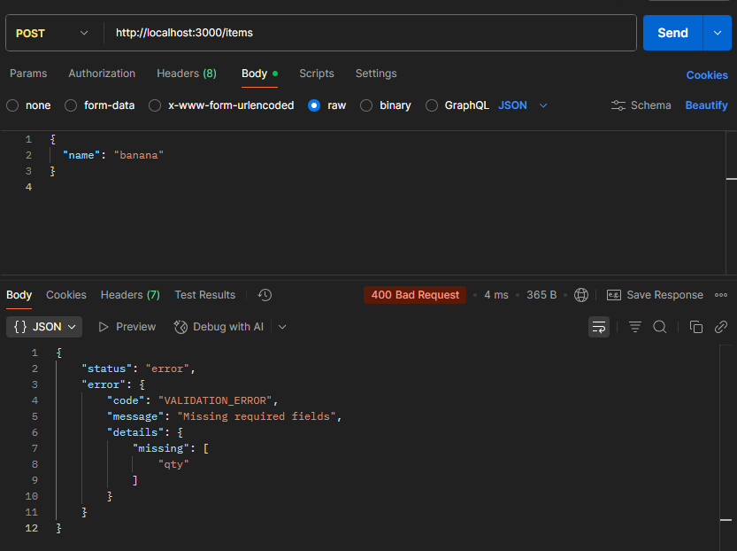
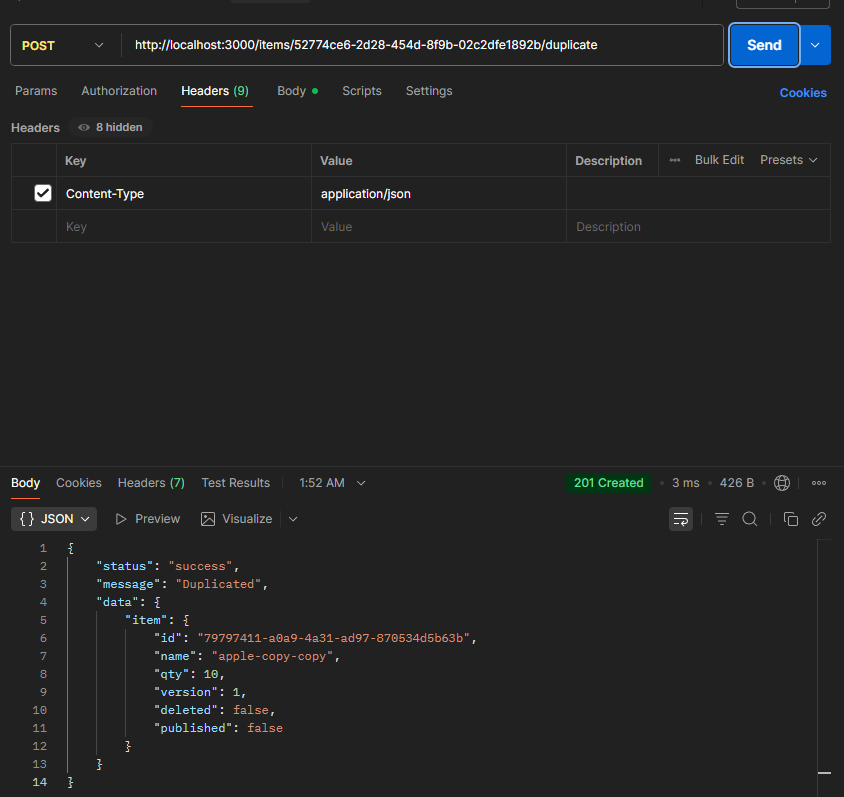


- **GET 메서드 테스트**  
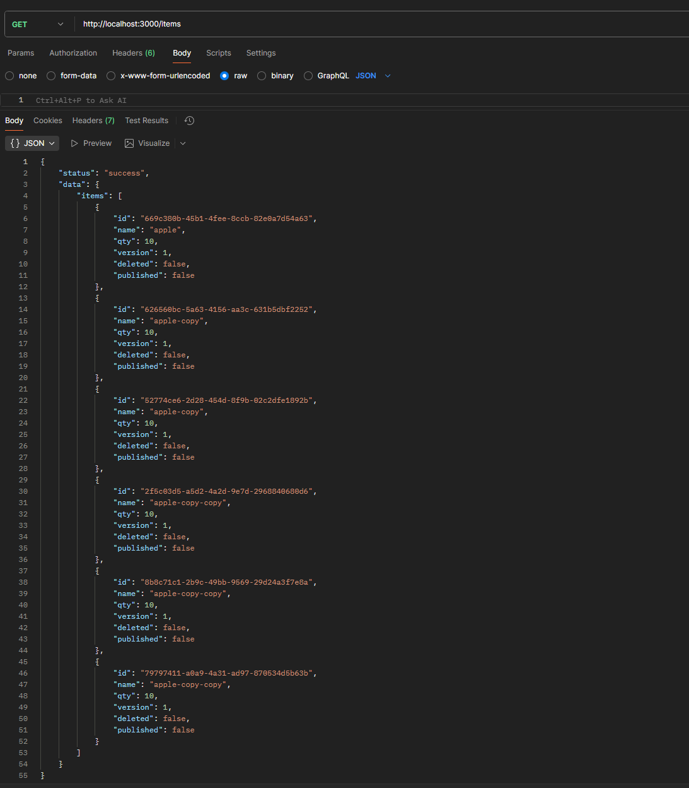
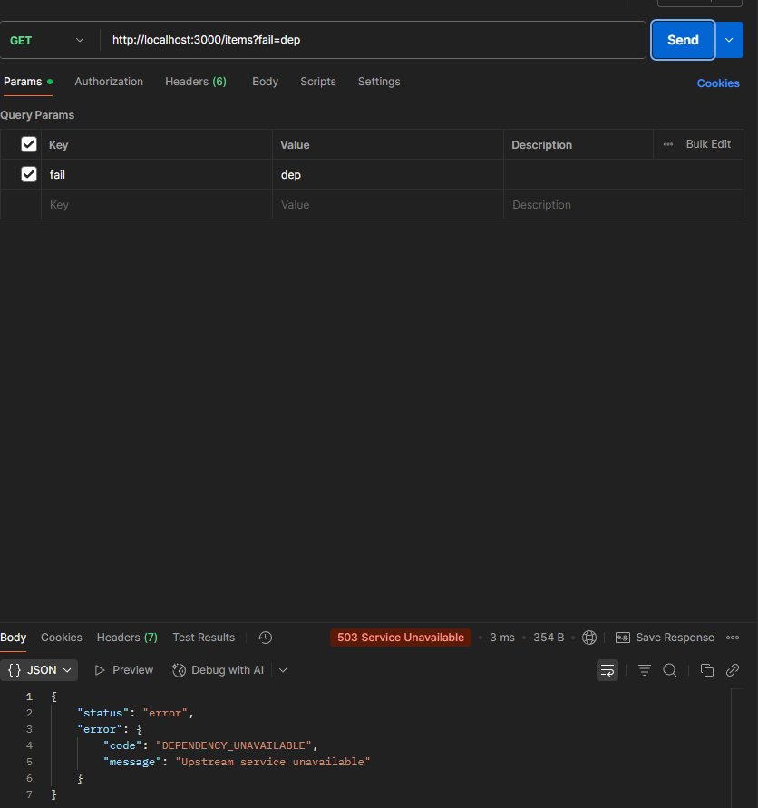
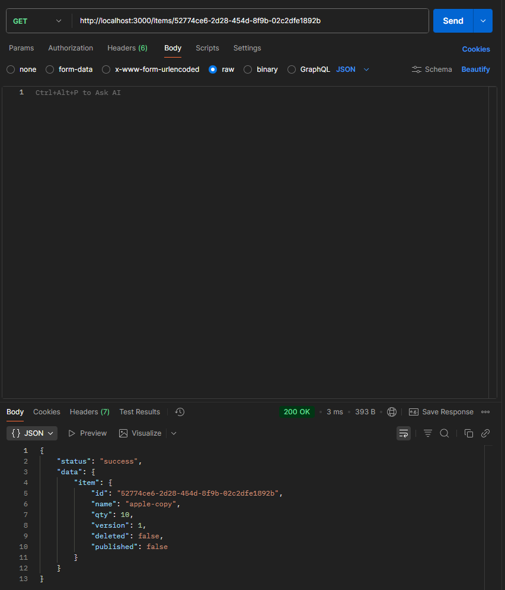
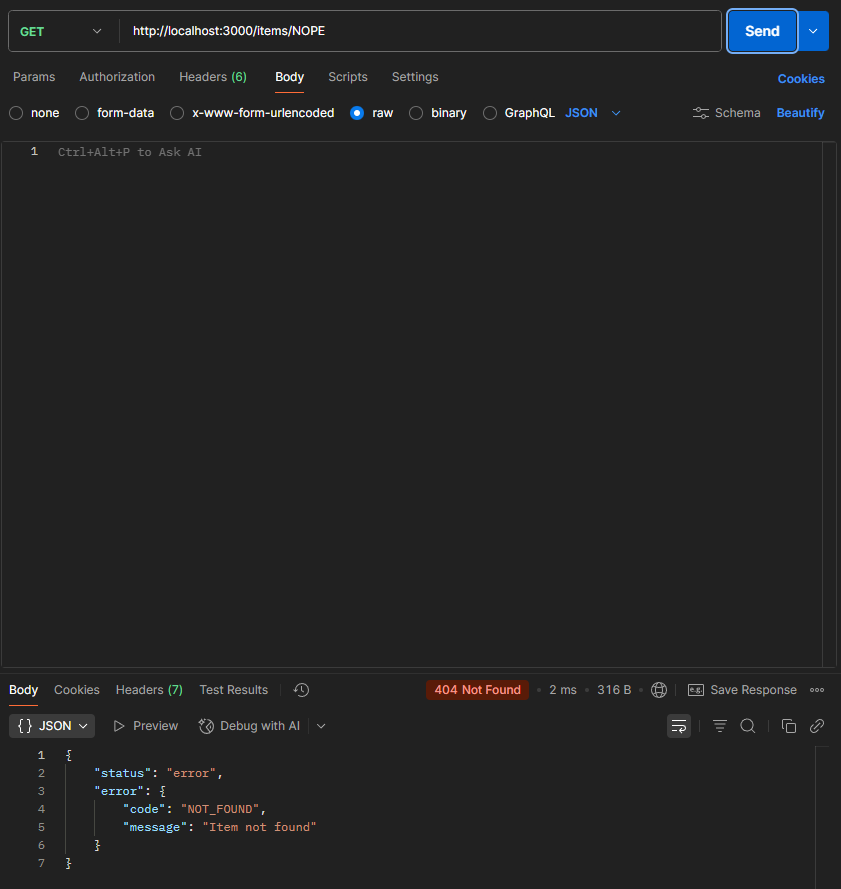

- **PUT 메서드 테스트**  
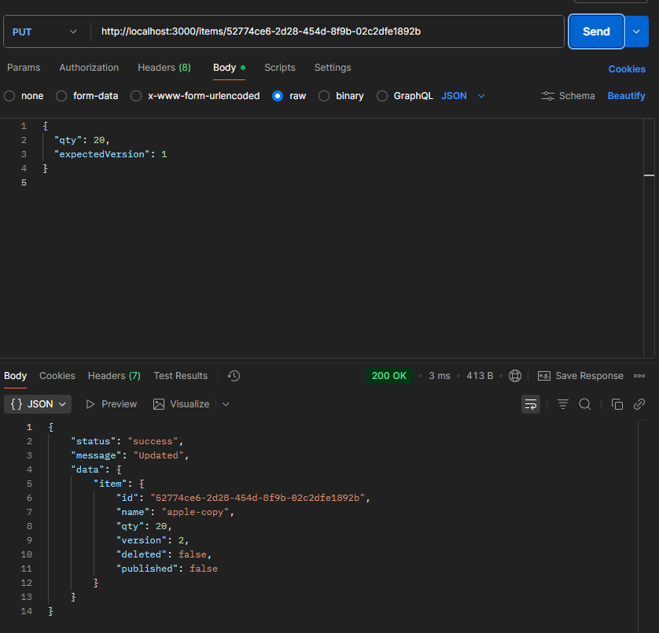
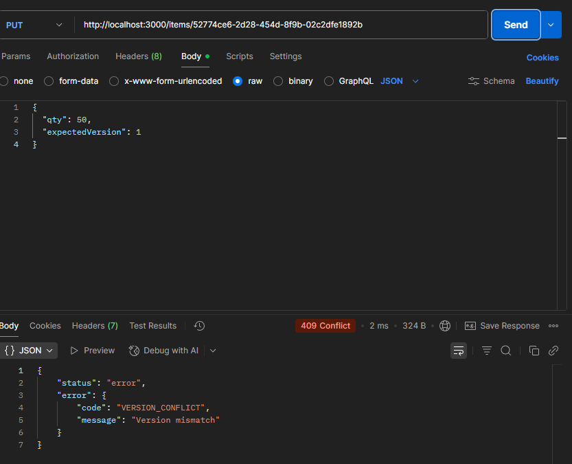
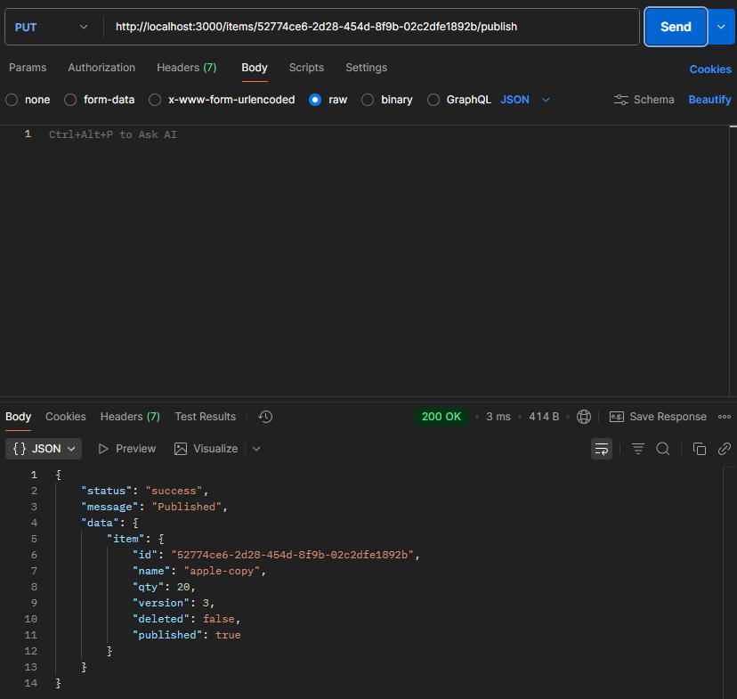
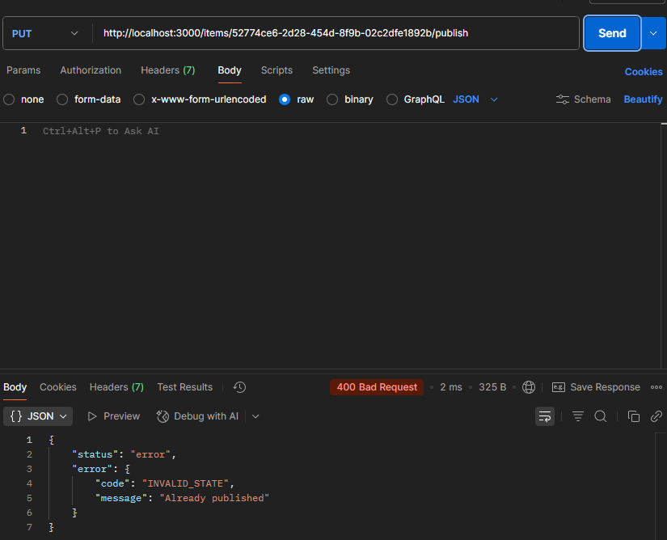

- **DELETE 메서드 테스트**  
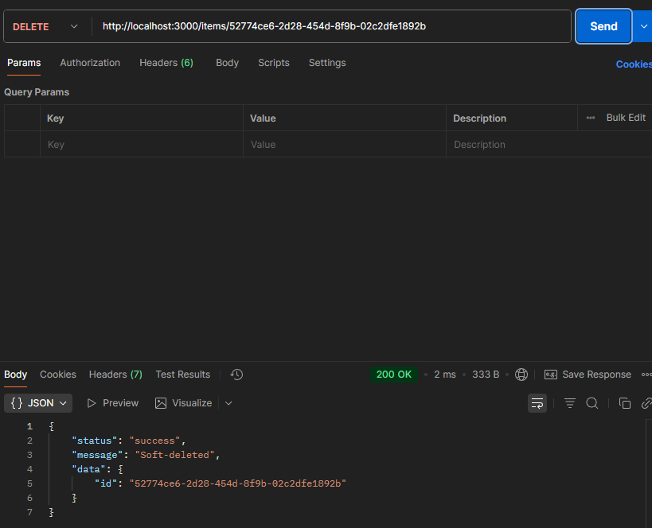
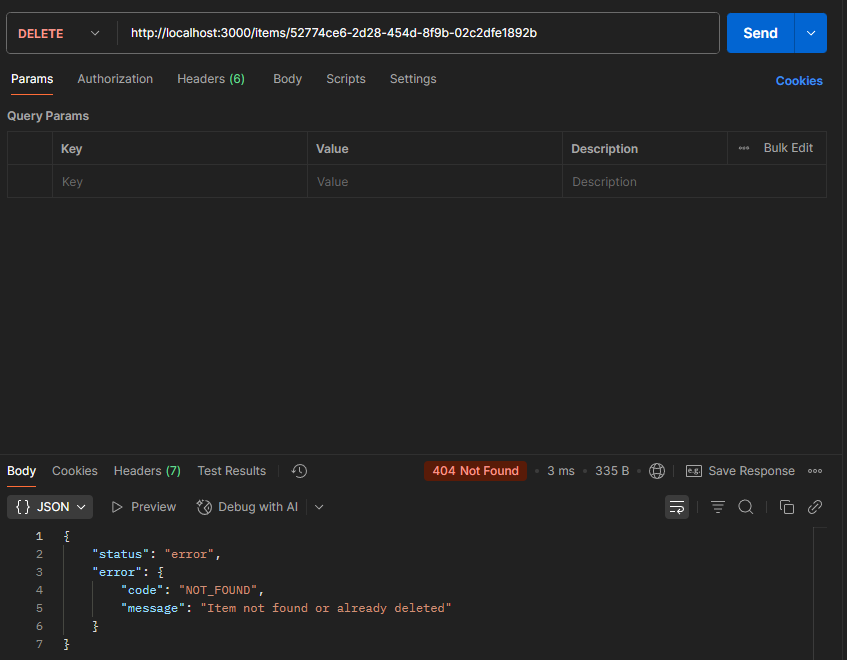

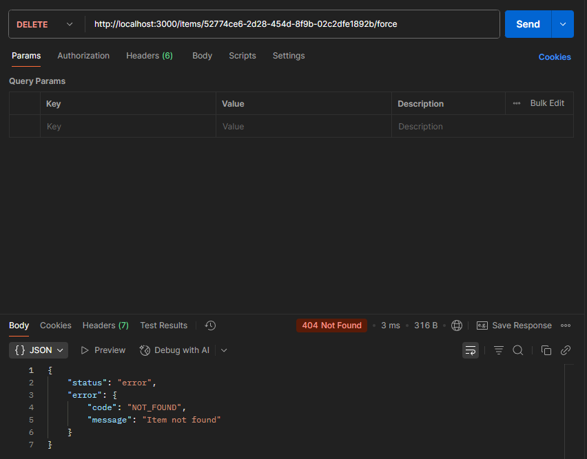

---

## 🧩 콘솔 로그 (미들웨어 동작 확인)

요청이 들어올 때마다 `logger.js` 미들웨어를 통해 아래와 같은 로그가 출력됩니다.

```
[2025-11-15T10:12:11.324Z] POST /items 201 4.12 ms
[2025-11-15T10:12:15.007Z] GET /items/unknown 404 1.98 ms
```
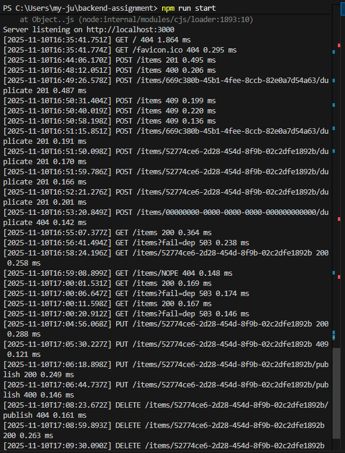
---

## 🧾 표준 응답 예시

### ✅ 성공 응답

```json
{
  "status": "success",
  "message": "Created",
  "data": {
    "item": {
      "id": "a1b2c3",
      "name": "apple",
      "qty": 10
    }
  }
}
```

### ❌ 오류 응답

```json
{
  "status": "error",
  "error": {
    "code": "VALIDATION_ERROR",
    "message": "필수 필드가 누락되었습니다."
  }
}
```

---

## 👤 제출 정보

| 항목 | 내용 |
|------|------|
| 이름 | 정사임 (Jeong Saim) |
| GitHub | [@samingming](https://github.com/samingming) |
| 과목 | 백엔드 프레임워크 실습 (Express.js) |
| 제출일 | 2025년 11월 15일 |

---
